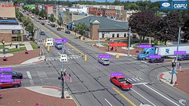

# Traffic-Control

Este repositorio contiene herramientas y notebooks desarrollados para la simulación, análisis y control del tráfico vehicular utilizando Python y Jupyter Notebook. El proyecto está orientado a la aplicación de técnicas de visión computacional, aprendizaje automático y análisis de video para la gestión eficiente del tráfico.

## Ejemplo de resultado (video procesado)

A continuación se muestra un fotograma de ejemplo extraído del video `output_video`, que representa la salida generada por el sistema de análisis de tráfico:

